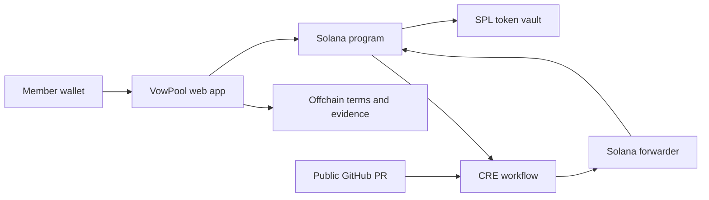

# VowPool

**Make a promise. Lock a stake. Let agreed rules decide where it goes.**

VowPool is commitment escrow for accountability groups, built on **Solana** with **Chainlink CRE** verification. Members agree on a goal, a deadline and who will verify completion, then lock test tokens. Success returns the stake; an unapproved peer commitment contributes it to the group's communal pool.

Built for TOKEN2049 Origins, VowPool starts with a real use case: an accountability group in 500 Global's Malaysian AI Residency. The group already uses money and social reputation to encourage follow-through. VowPool turns that agreement into shared, verifiable records and removes manual stake bookkeeping.

> **Hackathon demo · Solana Devnet · Test tokens only**
>
> The Solana program is deployed. CRE has performed real Devnet writes through local simulation and the official mock forwarder. A live CRE workflow/DON deployment has not been demonstrated; the program retains upgrade authority.

## The commitment loop

1. **Agree:** create a group and define the goal, stake, deadlines and verification rules. Terms are frozen at onchain creation.
2. **Activate:** appointed reviewers acknowledge their role, then the owner signs to lock the stake in the program-controlled vault.
3. **Verify:** peers approve completion, or CRE checks a specific public GitHub pull request against frozen criteria.
4. **Settle:** success creates a refund entitlement. Missing peer approval after the cutoff or a verified automated failure contributes the stake to the pool. The demo service delivers recorded refunds automatically, with a manual retry available.

Reviewer acknowledgment and completion approval are separate wallet actions. Once active, a commitment cannot be cancelled or edited by its owner.

| Mode | Who verifies? | What counts as success? |
| --- | --- | --- |
| A — One reviewer | One appointed group member | That reviewer approves |
| B — All reviewers | A fixed list of appointed group members | Every appointed reviewer approves |
| C — Any group member | Any eligible member other than the owner | One eligible member approves |
| D — GitHub PR | The fixed `github_pr_merged_v1` CRE policy | The exact PR merges into the exact branch after activation and by the goal deadline |

A/B require all appointed reviewers to acknowledge before activation. C/D need no reviewer acknowledgment. Peer approvals must be recorded onchain by the review cutoff.

For GitHub commitments, an API error is **unknown**, never proof of failure. If no conclusive result is recorded by the review deadline plus 48 hours, anyone can resolve the commitment as **unresolved**, returning the stake without marking the goal as achieved.

## Why Solana, CRE and AI?

**Solana enforces the agreement.** The Anchor program records permissions, acknowledgments, approvals, deadlines and outcomes, and controls SPL token escrow. It accounts separately for active stakes, unpaid refunds and forfeited pool funds. Treasury withdrawals cannot consume active escrow or unpaid refunds.

**CRE connects external facts to settlement.** The TypeScript workflow reads commitment state, fetches the exact public GitHub PR and evaluates its merge time and target branch. It also processes peer expiry and recorded refunds. The receiver checks forwarder authorization, workflow metadata and report bindings before accepting an automated result. The exercised demo path uses simulator identity and the official mock forwarder; live DON authentication remains unverified.

**AI helps write the agreement.** Optional AI drafting turns a natural-language goal into schema-validated terms or a fixed GitHub configuration for the user to review. Manual entry is available. AI has no authority to approve completion, generate executable verification workflows or move funds. A real provider call remains unverified in the saved demo evidence.



Goal text and evidence stay offchain; hashes bind the frozen terms to onchain records. The metadata database supports the interface and cannot authorize outcomes. Members sign their own actions. The server's utility payer funds demo grants and delivers refunds already authorized by the program.

## Review the demo evidence

These are **saved Devnet development-fixture results from 7 October 2026**, using disposable wallets. They are actual transactions, not evidence of a member browser rehearsal or live DON deployment.

| Scenario | Recorded result | Evidence |
| --- | --- | --- |
| Peer success and automatic refund | One test token locked, reviewer approval recorded, refund delivered without an owner payout action; eight receipts confirmed | [Verification record](deployments/self-service-verification.json) · [Refund transaction](https://explorer.solana.com/tx/4vo8tqfm1BDeLVLY2EaQ1bgpa24Pe4PEnRhQMAWfvjZerGUQmDgSJrvcsbqVkimy2rSzsbz9GgLXpHR5ZebU1VXT?cluster=devnet) |
| Peer expiry into the pool | An unapproved one-token commitment forfeited through a CRE simulation broadcast | [Fixture verification](deployments/staging-fixture-verification.json) · [Expiry transaction](https://explorer.solana.com/tx/5c3DFTvykwJu4bmug3SeQUQdmAR3RSJ6XDRBtBqRp2FmAwWsYKoMoMhyjN2VxfFSYdKYPdEJvrx6HZk8Q9of1bWF?cluster=devnet) |
| GitHub observation and Solana result | A real PR merged before activation was correctly rejected; the zero-stake checkpoint recorded failure on Devnet | [CRE checkpoint](deployments/cre-checkpoint.json) · [Result transaction](https://explorer.solana.com/tx/TM1BDgjjecXBDxdnq3EPtmzsHEHZVApnHvzuBahY5MaVYA4hdgxBCJbmJg3q6PEC9ZGpvskC4DaV8NCvn3Js633?cluster=devnet) |

**Remaining demonstration gap:** the complete AI-configured GitHub success flow—an actual qualifying post-activation merge, CRE result and stake refund—has not been demonstrated. Current tenant access does not enable live CRE deployment. Simulation broadcasts prove the exercised Devnet write path, not a deployed automation service.

Program: [`A2JT4HUJYEd3BL5xPXRiaXjvoFSMetY8zvLEPmRAxXPf`](https://explorer.solana.com/address/A2JT4HUJYEd3BL5xPXRiaXjvoFSMetY8zvLEPmRAxXPf?cluster=devnet) · [Deployment configuration](deployments/devnet.json) · [Anchor IDL](idl/vowpool.json)

## Try VowPool locally

Use **Bun 1.3.11** and **Node 24.11.1**; Node supplies the SQLite runtime. From the repository root:

```sh
bun install --frozen-lockfile
cp .env.example apps/web/.env.local
bun run dev
```

Open [localhost:3000](http://localhost:3000) and connect a browser wallet set to **Solana Devnet**. Keep `OPENAI_API_KEY` server-only; leaving it unset preserves the manual creation flow. Public mint/program configuration is included in [deployments/devnet.json](deployments/devnet.json). Its prepared browser-demo group still requires the founder's initialization signature according to the saved deployment record.

To exercise the peer flow with two wallets:

1. Choose **Create your group**, invite the second wallet and select the treasurer. Copy the invitation link for the reviewer.
2. Create a small mode-A commitment with future goal and review deadlines.
3. Connect the reviewer wallet and accept the reviewer role.
4. Reconnect the owner and lock the test-token stake.
5. Have the reviewer approve completion. Inspect the confirmed outcome, refund receipt and token balance.
6. Create another peer commitment and leave it unapproved. After the review cutoff, process expiry and inspect the pool balance.

Demo token grants and automatic refunds require a funded, server-only Devnet utility payer. Set `VOWPOOL_DEMO_PAYER_KEY_PATH` to your own local key file before starting the app. The grant requires a wallet signature and is capped; it is not an unlimited faucet. Members continue to sign creation, funding and approvals themselves. See the [technical guide](docs/technical-guide.md) for payer setup, bootstrap, production launch and manual refund recovery.

### Reproduce a CRE check

With the pinned CRE CLI, authenticated access and a disposable Devnet transmitter key configured:

```sh
CRE_SOLANA_PRIVATE_KEY="/absolute/path/to/cre-transmitter.json" \
  .tools/bin/cre workflow simulate workflows/accountability --project-root cre \
  --target local-simulation --non-interactive --trigger-index 0
```

This target fetches real GitHub data using sample timing; it sends **no Solana transaction**. The `rpc-check` target reads real accounts without writing. The `staging-settings` target supports Devnet writes with `--broadcast` to an explicitly configured development fixture. Full commands and policy setup are in the [technical guide](docs/technical-guide.md#cre-verification).

## Implementation and verification

| Component | Location |
| --- | --- |
| Next.js app, wallet flows, AI drafting and metadata service | [`apps/web`](apps/web) |
| Rust / Anchor escrow and settlement program | [`programs/vowpool`](programs/vowpool) |
| TypeScript CRE workflow | [`cre/workflows/accountability`](cre/workflows/accountability) |
| Shared schemas, canonical encoding and client logic | [`packages/shared`](packages/shared) |
| Public receipts and verification records | [`deployments`](deployments) |

```sh
bun run typecheck
bun run test
bun run build
```

The [integration record](docs/integration-check.md) documents earlier program checks: 24 compiled-SBF LiteSVM tests plus one local-validator RPC lifecycle test, along with receiver authorization checks and the Solana MCP autofixer. These cover permissions, unanimous approval, deadline boundaries, oracle binding, unresolved refunds, failed-payout recovery, replay and protected treasury accounting. See the [technical guide](docs/technical-guide.md#program-checks) to reproduce program checks; those require the Solana/Anchor toolchain and local validator.

## Scope and trust

This MVP supports fixed groups, one ordinary SPL test mint and public GitHub PR verification. Peers judge real-world goals; GitHub supplies merge facts. Neither proves work quality. Offchain hosting must remain available to retrieve original terms and evidence, and the current SQLite app needs a persistent host.

The program is upgradeable with retained authority. Live CRE deployment, private repositories, disputes, recurring goals and real funds are outside the demonstrated scope.

For deeper review: [product specification](docs/2026-10-07-accountability-mvp-design.md) · [technical guide](docs/technical-guide.md) · [integration evidence](docs/integration-check.md) · [demo runbook](docs/demo.md)
